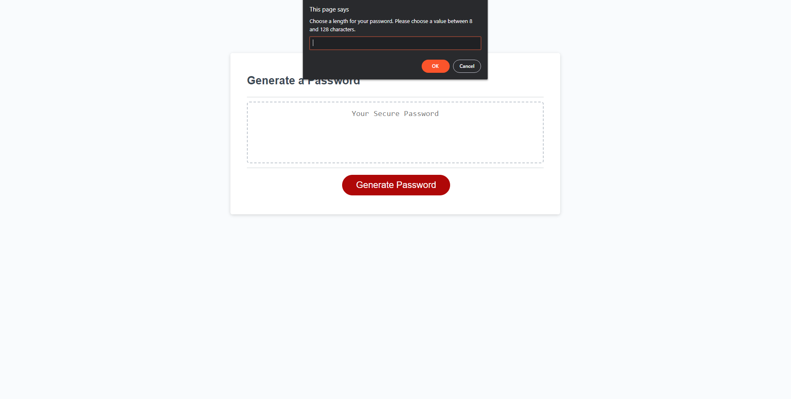

# Password Generator

## Description

This webpage allows a user to generate a randomized password using a selected combination of lowercase letters, uppercase letters, numbers, and special characters. This web application was created for a user who may not want to come up with their own password and wants a password that is a randomized string of characters with a specific length. This webpage was built using HTML and CSS, and the password generation function was build using JavaScript.

## Usage

In order to use the password generation webpage, first click on the button in the webpage that says "Generate Password". The site will ask you for your preferred password length, between 8 and 128 characters. If you do not enter a number or a number that does not fall within the range specified, the site will continue to ask for a preferred length until you enter a valid length. Then, the site will ask you to specify your preferrence for including lowercase letters, uppercase letters, numbers, and special characters. Click "OK" if you want to use the character type when asked, or "Cancel" if you do not wish to use the character type in question. After choosing "OK" or "Cancel" for each of the four character types, the webpage will generate a randomized password using the character types that you selected with the length that you entered.

## Credits

The HTML and CSS for this webpage was built by the University of Denver Coding Bootcamp, while the JavaScript was mostly written by Ron Buttermore.

## License

MIT Open-Source License

Copyright (c) 2023 Ron Buttermore

Permission is hereby granted, free of charge, to any person obtaining a copy of this software and associated documentation files (the "Software"), to deal in the Software without restriction, including without limitation the rights to use, copy, modify, merge, publish, distribute, sublicense, and/or sell copies of the Software, and to permit persons to whom the Software is furnished to do so, subject to the following conditions:

The above copyright notice and this permission notice shall be included in all copies or substantial portions of the Software.

THE SOFTWARE IS PROVIDED "AS IS", WITHOUT WARRANTY OF ANY KIND, EXPRESS OR IMPLIED, INCLUDING BUT NOT LIMITED TO THE WARRANTIES OF MERCHANTABILITY, FITNESS FOR A PARTICULAR PURPOSE AND NONINFRINGEMENT. IN NO EVENT SHALL THE AUTHORS OR COPYRIGHT HOLDERS BE LIABLE FOR ANY CLAIM, DAMAGES OR OTHER LIABILITY, WHETHER IN AN ACTION OF CONTRACT, TORT OR OTHERWISE, ARISING FROM, OUT OF OR IN CONNECTION WITH THE SOFTWARE OR THE USE OR OTHER DEALINGS IN THE SOFTWARE.